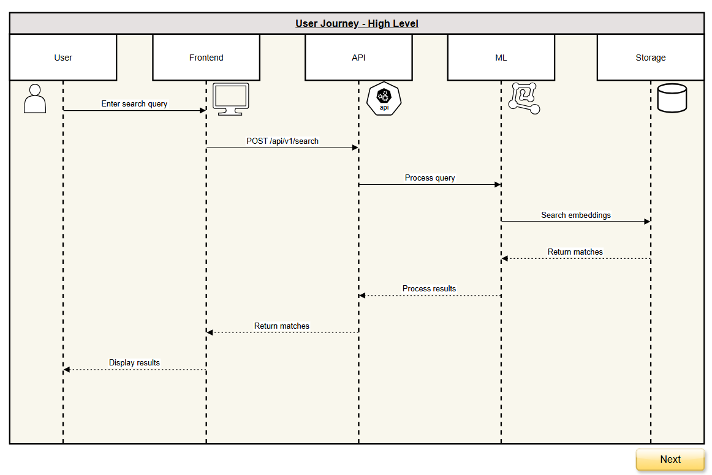

# Multi-Modal Image Retrieval System

A case study for Standard Bank as part of their recruitment process for a **Specialist : AI Engineer** role.

This build is focused on showcasing a full end-to-end implementation of a Multi-Modal Image retrieval application.

## Demo
[Demo Video](media/assets/screen-capture.webm)


## Features
- Text-to-image search using natural language queries
- Multiple AI model support (CLIP and BLIP2)
- RESTful API architecture
- Real-time image similarity search
- Efficient embedding storage and retrieval
- Scalable architecture 

## Project Structure
```bash
project/
├── webapp/ 
├── api/ 
│ ├── ml/ 
│ ├── api/ 
│ └── config/ 
└── docs/ 
└── notebooks/
```

## Prerequisites
- Python 3.8+
- Node.js 16+
- Docker

## Quick Start - using Docker

1. Clone the repository:

```bash
git clone https://github.com/shaundamon/standard-bank-interview-case-study.git

cd standard-bank-interview-case-study
```

2. Copy the example environment file and rename it:

```bash
cp .env.example .env
```

3. [**Optional - Only required when switching from CLIP to BLIP2 model, CLIP is default**] Add your Hugging Face API token to the .env file (get one at https://huggingface.co/settings/tokens):

4. Build and start the containers:

```bash
docker-compose up --build
```

The application will automatically:
- Start the backend API server
- Start the frontend development server
- Check for the required dataset
- Download the dataset if not present
No additional setup is required - just wait for the initial dataset download to complete before using the search functionality.

5. Access the application:
- Frontend: http://localhost:5173
- Backend API: http://localhost:8000
- API Documentation: http://localhost:8000/api/docs/

## Quick Start - locally

1. Clone the repository:

```bash
git clone https://github.com/shaundamon/standard-bank-interview-case-study.git

cd standard-bank-interview-case-study
```

2. Create and activate virtual environment:

```bash
python3 -m venv venv

source venv/bin/activate # windows: venv\Scripts\activate
```

3. Set up the backend (see [Backend Setup](api/README.md))

4. Set up the frontend (see [Frontend Setup](webapp/README.md))

## Architecture



## API Documentation
Once the backend is running, visit:
- Swagger UI: `http://localhost:8000/api/docs/`
- ReDoc: `http://localhost:8000/api/redoc/`

## Assumptions
- The system assumes that 500 images are enough for demonstrating the system's capabilities. 
- Another assumption comes from the case study mentioning that we need to return the top-K matching neighbors but it did not specify the value for the k. 
The implementation assumes showing the top-5 results provides the users with enough options.

---
